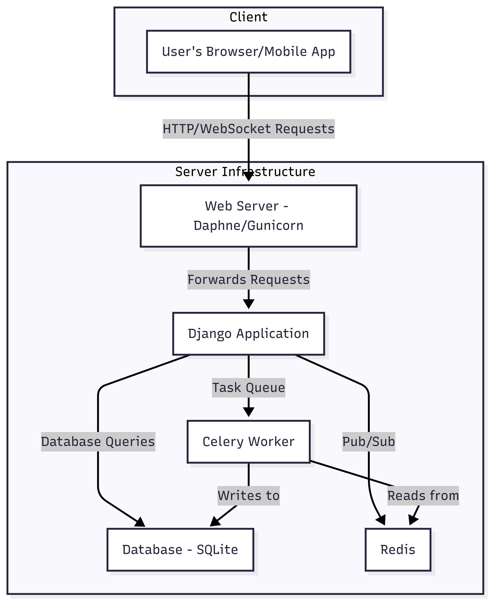
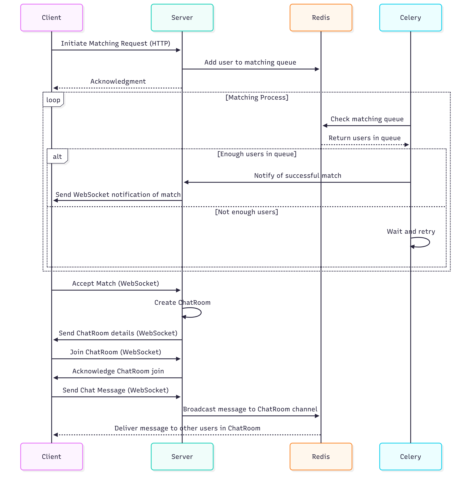

# Project Blueberry (English)

## Overview

Blueberry is a Django-based web application designed to facilitate real-time matching and communication between users. The project leverages Django Channels for WebSocket communication, Celery for asynchronous task processing, and a variety of Django applications to handle different aspects of the system, including user authentication, chat, and various matching functionalities.

## Demo Video

  

## System Architecture

The system is built around a central Django project with several interconnected applications. Here's a high-level overview of the architecture:

- **Web Server**: A WSGI/ASGI server (like Gunicorn/Daphne) handles HTTP and WebSocket requests.
- **Django Backend**: The core of the application, handling business logic, database interactions, and user authentication.
- **Database**: A relational database (SQLite) to store user data, chat messages, and matching information.
- **Redis**: Used as a message broker for both Celery and Django Channels, enabling real-time communication and background task processing.
- **Celery**: Manages asynchronous tasks such as sending notifications, processing matching queues, and handling time-based events.
- **Frontend**: A client-side application (likely a JavaScript framework like React or a mobile app) that interacts with the Django backend via REST APIs and WebSockets.

  

## Why These Technologies?

-   **Django**: Serves as the robust and scalable backend framework for Blueberry, providing the foundation for user management, matching logic, and API endpoints. Its "batteries-included" philosophy accelerates development of core features like authentication and database interactions.
-   **Django Channels**: Essential for Blueberry's real-time features, enabling instant chat messages between matched users and live updates on matching status. It allows the server to push data to clients without constant polling, creating a highly responsive user experience.
-   **Daphne**: As the ASGI server for Django Channels, Daphne efficiently handles the numerous concurrent WebSocket connections required for Blueberry's real-time chat and matching notifications. It ensures that the application remains responsive even under heavy real-time traffic.
-   **WebSockets**: The backbone of Blueberry's real-time communication. They provide persistent, low-latency connections for features like live chat rooms, real-time matching updates, and immediate notifications, significantly enhancing user interaction and engagement.
-   **Redis**: Utilized in Blueberry as the channel layer for Django Channels, facilitating seamless communication between different chat room instances and matching consumers. It also acts as the message broker for Celery, managing the queues for asynchronous tasks like background matching processes and timed notifications.
-   **Celery**: Powers Blueberry's asynchronous operations, such as executing complex matching algorithms in the background, sending delayed notifications (e.g., "chat room closing soon"), and managing the lifecycle of chat rooms. This offloads heavy processing from the main web server, ensuring a smooth and responsive user interface.
-   **django-allauth**: Provides a secure and comprehensive solution for user authentication and account management in Blueberry, including features like email verification and password reset, which are critical for a reliable user base.
-   **djangorestframework**: Enables Blueberry to expose well-structured RESTful APIs for its mobile or web frontend. This allows for clear separation of concerns and efficient data exchange for user profiles, matching preferences, and other application data.
-   **django-cors-headers**: Crucial for enabling secure cross-origin requests between Blueberry's frontend (which might be hosted on a different domain or port) and the Django backend, ensuring proper communication while adhering to web security standards.
-   **python-decouple**: Used in Blueberry to manage sensitive configurations (like API keys or database credentials) securely and flexibly. It allows environment-specific settings to be loaded without hardcoding them, which is vital for deployment across different environments (development, staging, production).

## Sequence Diagram: User Matching and Chat

This diagram illustrates the process of a user initiating a matching request, being matched with other users, and then entering a chat room.

  

## Applications

-   **my_app**: Core application for managing custom user models and related functionalities.
-   **my_auth**: Handles user authentication, registration, and profile management.
-   **chat**: Manages real-time chat functionality using Django Channels.
-   **matching**: Implements the logic for matching users based on specific criteria.
-   **matching2**: Appears to be another version or component of the matching system.
-   **taxi_matching**: A specific implementation for taxi-sharing matching.

---

# 프로젝트 블루베리 (Korean)

## 개요

블루베리는 사용자 간의 실시간 매칭 및 통신을 용이하게 하도록 설계된 Django 기반 웹 애플리케이션입니다. 이 프로젝트는 WebSocket 통신을 위한 Django Channels, 비동기 처리를 위한 Celery, 그리고 사용자 인증, 채팅, 다양한 매칭 기능 등 시스템의 여러 측면을 처리하기 위한 다양한 Django 애플리케이션을 활용합니다.

## 데모 비디오

  

## 시스템 아키텍처

이 시스템은 여러 상호 연결된 애플리케이션으로 구성된 중앙 Django 프로젝트를 중심으로 구축됩니다. 다음은 아키텍처에 대한 개략적인 개요입니다.

-   **웹 서버**: WSGI/ASGI 서버(예: Gunicorn/Daphne)는 HTTP 및 WebSocket 요청을 처리합니다.
-   **Django 백엔드**: 비즈니스 로직, 데이터베이스 상호 작용 및 사용자 인증을 처리하는 애플리케이션의 핵심입니다.
-   **데이터베이스**: 사용자 데이터, 채팅 메시지 및 매칭 정보를 저장하는 관계형 데이터베이스(SQLite)입니다.
-   **Redis**: Celery 및 Django Channels 모두를 위한 메시지 브로커로 사용되어 실시간 통신 및 백그라운드 작업 처리를 가능하게 합니다.
-   **Celery**: 알림 전송, 매칭 큐 처리, 시간 기반 이벤트 처리와 같은 비동기 작업을 관리합니다.
-   **프론트엔드**: REST API 및 WebSockets를 통해 Django 백엔드와 상호 작용하는 클라이언트 측 애플리케이션(React 또는 모바일 앱과 같은 JavaScript 프레임워크일 가능성 높음)입니다.

  

## 이러한 기술을 사용하는 이유

-   **Django**: 블루베리의 사용자 관리, 매칭 로직 및 API 엔드포인트의 기반을 제공하는 강력하고 확장 가능한 백엔드 프레임워크 역할을 합니다. "배터리 포함" 철학은 인증 및 데이터베이스 상호 작용과 같은 핵심 기능 개발을 가속화합니다.
-   **Django Channels**: 블루베리의 실시간 기능에 필수적이며, 매칭된 사용자 간의 즉각적인 채팅 메시지와 매칭 상태에 대한 실시간 업데이트를 가능하게 합니다. 서버가 지속적인 폴링 없이 클라이언트에 데이터를 푸시할 수 있도록 하여 매우 반응적인 사용자 경험을 제공합니다.
-   **Daphne**: Django Channels의 ASGI 서버로서, Daphne는 블루베리의 실시간 채팅 및 매칭 알림에 필요한 수많은 동시 WebSocket 연결을 효율적으로 처리합니다. 이는 많은 실시간 트래픽에도 불구하고 애플리케이션이 반응성을 유지하도록 보장합니다.
-   **WebSockets**: 블루베리의 실시간 통신의 핵심입니다. 라이브 채팅방, 실시간 매칭 업데이트, 즉각적인 알림과 같은 기능에 지속적이고 낮은 지연 시간 연결을 제공하여 사용자 상호 작용 및 참여를 크게 향상시킵니다.
-   **Redis**: 블루베리에서 Django Channels의 채널 레이어로 활용되어 다양한 채팅방 인스턴스와 매칭 소비자 간의 원활한 통신을 용이하게 합니다. 또한 Celery의 메시지 브로커 역할을 하여 백그라운드 매칭 프로세스 및 시간 지정 알림과 같은 비동기 작업을 위한 큐를 관리합니다.
-   **Celery**: 복잡한 매칭 알고리즘을 백그라운드에서 실행하고, 지연된 알림(예: "채팅방 곧 종료")을 보내고, 채팅방의 수명 주기를 관리하는 등 블루베리의 비동기 작업을 지원합니다. 이는 주 웹 서버에서 무거운 처리를 오프로드하여 부드럽고 반응적인 사용자 인터페이스를 보장합니다.
-   **django-allauth**: 블루베리에서 사용자 인증 및 계정 관리를 위한 안전하고 포괄적인 솔루션을 제공하며, 신뢰할 수 있는 사용자 기반에 중요한 이메일 확인 및 비밀번호 재설정과 같은 기능을 포함합니다.
-   **djangorestframework**: 블루베리가 모바일 또는 웹 프론트엔드에 잘 구조화된 RESTful API를 노출할 수 있도록 합니다. 이를 통해 관심사 분리를 명확히 하고 사용자 프로필, 매칭 기본 설정 및 기타 애플리케이션 데이터에 대한 효율적인 데이터 교환이 가능합니다.
-   **django-cors-headers**: 블루베리의 프론트엔드(다른 도메인이나 포트에서 호스팅될 수 있음)와 Django 백엔드 간의 안전한 교차 출처 요청을 가능하게 하는 데 중요하며, 웹 보안 표준을 준수하면서 적절한 통신을 보장합니다.
-   **python-decouple**: 블루베리에서 민감한 구성(예: API 키 또는 데이터베이스 자격 증명)을 안전하고 유연하게 관리하는 데 사용됩니다. 환경별 설정을 하드코딩하지 않고 로드할 수 있도록 하여 다양한 환경(개발, 스테이징, 프로덕션)에 배포하는 데 필수적입니다.

## 시퀀스 다이어그램: 사용자 매칭 및 채팅

이 다이어그램은 사용자가 매칭 요청을 시작하고, 다른 사용자와 매칭된 다음, 채팅방에 입장하는 과정을 보여줍니다.

  

## 애플리케이션

-   **my_app**: 사용자 정의 사용자 모델 및 관련 기능을 관리하기 위한 핵심 애플리케이션입니다.
-   **my_auth**: 사용자 인증, 등록 및 프로필 관리를 처리합니다.
-   **chat**: Django Channels를 사용하여 실시간 채팅 기능을 관리합니다.
-   **matching**: 특정 기준에 따라 사용자를 매칭하는 로직을 구현합니다.
-   **matching2**: 매칭 시스템의 다른 버전 또는 구성 요소로 보입니다.
-   **taxi_matching**: 택시 공유 매칭을 위한 특정 구현입니다.